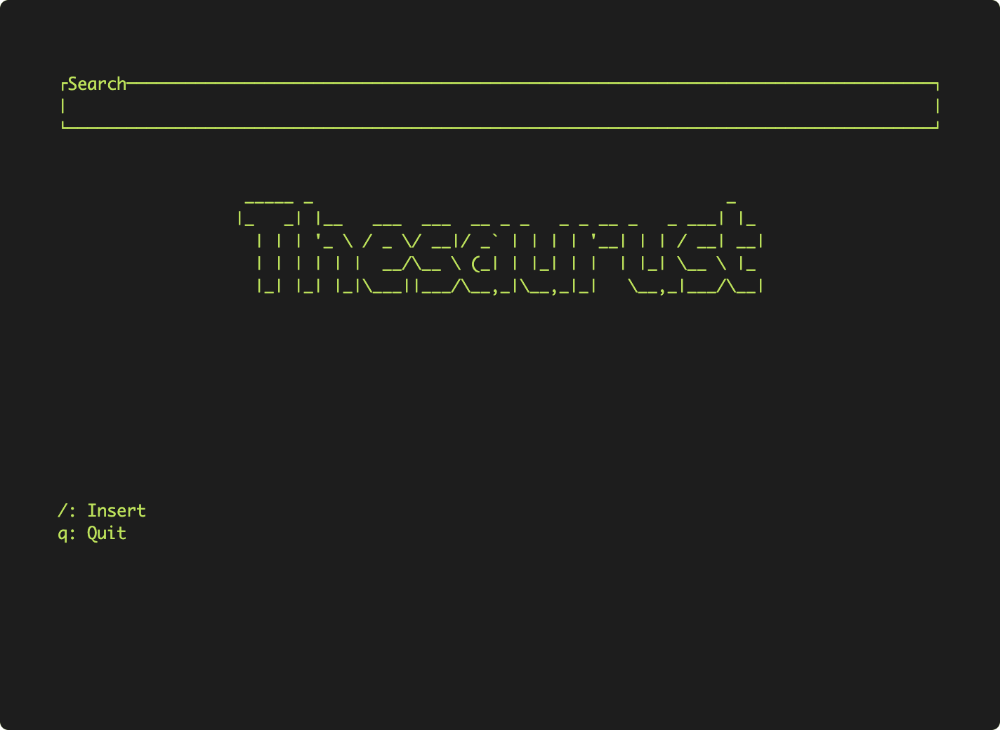

<details>
<summary>Table of Contents</summary>

- [thesaurust](#thesaurust)
  - [How it works](#how-it-works)
  - [Installation](#installation)
  - [Usage](#usage)
  - [Roadmap](#roadmap)

</details>

# thesaurust

A simple dictionary application built within the terminal, written in Rust.


## How it works

The data is fetched from the API provided by <https://dictionaryapi.dev/>. Since words can contain more than one meanings, the user can toggle between different meanings based on the parts of speech the word has.

`thesaurust` has built-in spellchecking. The inserted word will first be sent to <https://api.datamuse.com>. It will generate a list of words that has the closest spelling to the original. Of course, if the original is spelled correctly, the word with the highest score will be the same as the original.

## Installation

You need to install [Rust](https://www.rust-lang.org/tools/install) before you can proceed.

Clone this repository:

```zsh
git clone https://github.com/QuietPigeon2001/thesaurust
```

Navigate to the repository and run the following commands:

```zsh
cargo install --locked cargo-thesaurust 
thesaurust
```

## Usage

- <kbd>/</kbd>: Insert the word you would like to look for.
- <kbd>Enter</kbd>: Search.
- <kbd>j</kbd>, <kbd>k</kbd>: Select the part of speech and press <kbd>Enter</kbd>.
- <kbd>l</kbd>, <kbd>h</kbd>: Toggle between multiple definitions.
- <kbd>q</kbd>: Exit the app.

## Roadmap

- [x] Show an example with the definition (if available)
- [x] Toggle between parts of speech
- [x] Toggle between definitions with the same part of speech
- [x] Use a spellchecking API to suggest correct spelling for words
- [x] Show synonyms
- [x] Publish crate
- [ ] Loading screens
- [ ] Allow users to select similarly spelled words
